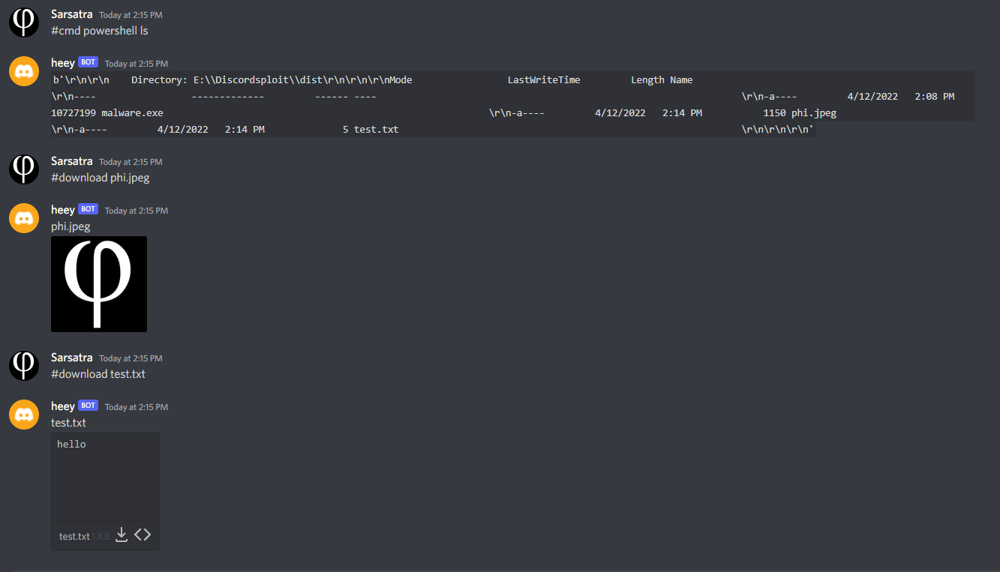

# DiscordSploit
Penetration testing tool using discord servers for the server
Now available Windows only
## Installation
* Clone the repo
```
git clone https://github.com/sarsatra/DiscordSploit.git
```
* Install the requirements
```
pip install -r requirements.txt
```
* Create a discord bot and add it to your server then get its token
## Usage
```
python main.py
```
## Photos

## Terms of Use
* THIS PROJECT IS FOR EDUCATIONAL PURPOSES ONLY
* THE AUTHOR OF THE PROJECT IS NOT RESPONSIBLE FOR ANY CONSEQUENCES FROM THIS PROJECT

## Credits

* [PyInstaller](https://github.com/pyinstaller) - The python compiler module was based on his script **PyInstaller**. 
* [Rapptz](https://github.com/Rapptz) - The discord.py was based on his script **discord.py**. 

